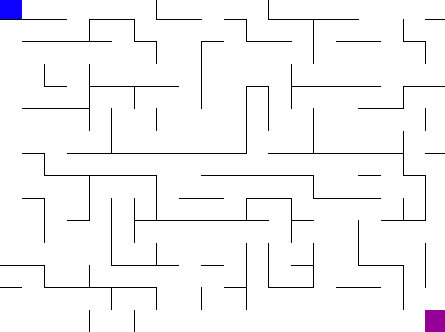
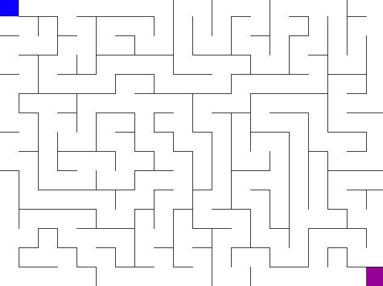

Now that we have maze generation working, it's time to get started on solving our maze.

We'll solve our generated maze with two different methods:

1. Randomized, pre-order depth first search (similar to how we generated the maze)
2. Breadth first search

Using depth first search will generally be quicker but implementing both DFS and BFS will help you visualize each search algorithm.

# More Bit Manipulation!

Go back to `maze.py` so we can finish up a few more methods needed for DFS solving of a maze.

## cell_neighbors

First off, let's update `cell_neighbors`. `cell_neighbors` is supposed to use `state` to determine which neighbors are important -- we only implemented it for `state == 'create'`. When `state == 'solve'`, we only want neighbors that are accessible (no wall in their direction) and unvisited (are not on a backtrack path or solution path yet). We'll have to use both *bitwise OR* and *bitwise AND* for this.

> [action]
>
> Complete the implementation of `cell_neighbors` so that it:
>
>     creates empty list of neighbors
>     for each direction
>         calculate new cell from cell
>         if new cell in that direction is within the bounds of maze
>             if state is create and all of new cell's walls are up
>                 add (new cell index, COMPASS index of direction) to neighbors
>             if state is solve and no wall between cell and new cell
>                 if new cell not on solution or backtrack path
>                     add (new cell index, COMPASS index of direction) to neighbors
>     return neighbors

<!-- Make School -->

> [solution]
>
> The completed `cell_neighbors` method should look like this:
>
>     def cell_neighbors(self, cell):
>         x, y = self.x_y(cell)
>         neighbors = []
>         for i in range(4):
>             new_x = x + COMPASS[i][0]
>             new_y = y + COMPASS[i][1]
>             if self.cell_in_bounds(new_x, new_y):
>                 new_cell = self.cell_index(new_x, new_y)
>                 if self.state == 'create':
>                     if not (self.maze_array[new_cell] & WALL_BITS):
>                         neighbors.append((new_cell, i))
>                 elif self.state == 'solve':
>                     if (self.maze_array[cell] & WALLS[i]):
>                         if not (self.maze_array[new_cell] &
>                                 (BACKTRACK_BITS | SOLUTION_BITS)):
>                             neighbors.append((new_cell, i))
>         return neighbors
>
> `self.maze_array[cell] & WALL_BITS` will be zero if `cell` has a wall in the direction of `new_cell`. `(BACKTRACK_BITS | SOLUTION_BITS)` combines the two bit masks. That means that you can use `(self.maze_array[new_cell] & (BACKTRACK_BITS | SOLUTION_BITS))` to check if the cell contains any solution or backtrack path data.

## visit_cell

`visit_cell` needs to wipe out all the solution bits of `from_cell` and set them to the current direction. Then it needs to add backtrack bits to `to_cell` pointing in the direction of `from_cell`.

We'll need two new bitwise operators to do this:

1. The compliment operator (`~` in Python) -- this flips all the bits. Zeros become ones and ones become zeros. `~0b1010` evaluates to `0b0101`. We'll use this to invert `SOLUTION_BITS`.
2. The left bit shift operator (`<<` in Python) -- this moves all the bits over. `0b1111 << 8` evaluates to `0b111100000000`. We'll use this to shift values from `WALLS` and `OPPOSITE_WALLS` to the right position for updating solution bits and backtrack bits respectively.

> [action]
>
> Complete the implementation of `visit_cell`. It should clear the solution bits out of `from_cell`, update solution bits in `from_cell` using `WALLS[compass_index]`, update the backtrack bits in `to_cell` using `OPPOSITE_WALLS[compass_index]`. Leave the call to `draw_connect_cells` or else the maze visualization will not be updated!

<!-- Make School -->

> [solution]
>
> The completed `visit_cell` method should look like this:
>
>     def visit_cell(self, from_cell, to_cell, compass_index):
>         self.maze_array[from_cell] &= ~SOLUTION_BITS
>         self.maze_array[from_cell] |= (WALLS[compass_index] << 8)
>         self.maze_array[to_cell] |= (OPPOSITE_WALLS[compass_index] << 12)
>         self.draw_visited_cell(from_cell)

## backtrack

`backtrack` is a simple one. All we have to do is clear out the solution bits of `cell`.

> [action]
>
> Complete the implementation of `backtrack`.

<!-- Make School -->

> [solution]
>
> The completed `backtrack` method should look like this:
>
>     def backtrack(self, cell):
>         self.maze_array[cell] &= ~SOLUTION_BITS
>         self.draw_backtracked_cell(cell)

# Solving with Depth First Search

The pseudocode below should look very familiar. There is not much of a difference between maze generation and maze solving using DFS.

## Pseudocode for Solving a Maze with DFS

    create a stack for backtracking
    set current cell to 0
    set visited cells to 0

    while current cell not goal
        get unvisited neighbors using cell_neighbors
        if at least one neighbor
            choose random neighbor to be new cell
            visit new cell using visit_cell
            push current cell to stack
            set current cell to new cell
            add 1 to visited cells
        else
            backtrack current cell using backtrack method
            pop from stack to current cell
        call refresh_maze_view to update visualization

    set state to 'idle'

> [action]
>
> Implement the pseudocode above in the `solve_dfs` function of `solve_maze.py`. Run `python3 solve_maze.py dfs` to see if your maze is getting solved correctly!

If you did everything right, your DFS solver should look like this:

# Bit Manipulation for BFS

## bfs_visit_cell

`bfs_visit_cell` is more simple than `visit_cell` used in DFS. It only needs to set the backtrack bits for `cell` to point towards the cell it came from.

> [action]
>
> Complete the implementation of `bfs_visit_cell`.

<!-- Make School -->

> [solution]
>
> The completed `bfs_visit_cell` method should look like this:
>
>     def bfs_visit_cell(self, cell, from_compass_index):
>         self.maze_array[cell] |= (OPPOSITE_WALLS[from_compass_index] << 12)
>         self.draw_bfs_visited_cell(from_cell)

## reconstruct_solution

`reconstruct_solution` constructs a path from the start cell (root node) to `cell` by following the backtrack bits to build it in reverse. It should set the solution bits along the way.

> [action]
>
> Complete the implementation of `reconstruct_solution` using the following pseudocode:
>
>     draw cell as part of solution path with draw_visited_cell
>     isolate the four backtrack bits to previous cell bits
>     set i to index of previous cell bits in WALLS
>     use i to calculate index of previous cell, set to previous cell
>     update solution bits of previous cell to point towards cell
>     call refresh_maze_view to update visualization
>     if previous cell not start cell, reconstruct_solution(previous cell)

<!-- Make School -->

> [solution]
>
> The completed `reconstruct_solution` method should look something like this:
>
>     def reconstruct_solution(self, cell):
>         self.draw_visited_cell(cell)
>         prev_cell_bits = (self.maze_array[cell] & BACKTRACK_BITS) >> 12
>         try:
>             i = WALLS.index(prev_cell_bits)
>         except ValueError:
>             print('ERROR - BACKTRACK BITS INVALID!')
>         x, y = self.x_y(cell)
>         prev_x = x + COMPASS[i][0]
>         prev_y = y + COMPASS[i][1]
>         prev_cell = self.cell_index(prev_x, prev_y)
>         self.maze_array[prev_cell] |= (OPPOSITE_WALLS[i] << 8)
>         self.refresh_maze_view()
>         if prev_cell != 0:
>             self.reconstruct_solution(prev_cell)

# Solving with Breadth First Search

Breadth first search visits all immediate children in order. We'll be using the pseudocode below to implement BFS to solve some mazes.

## Pseudocode for Solving a Maze with BFS

    create a queue
    set current cell to 0
    set in direction to 0b0000
    set visited cells to 0
    enqueue (current cell, in direction)

    while current cell not goal and queue not empty
        dequeue to current cell, in direction
        visit current cell with bfs_visit_cell
        add 1 to visited cells
        call refresh_maze_view to update visualization

        get unvisited neighbors of current cell using cell_neighbors, add to queue

    trace solution path and update cells with solution data using reconstruct_solution

    set state to 'idle'

> [action]
>
> Implement the pseudocode above in the `solve_bfs` function of `solve_maze.py`. Run `python3 solve_maze.py bfs` to see if your maze is getting solved correctly!

If you did everything right, your BFS solver should look like this:

<!-- # Where to Go From Here -->

<!-- disclaimer -->

<!-- complete solution_array -->

<!-- A* search -->

<!-- save mazes to file / load from file -->
